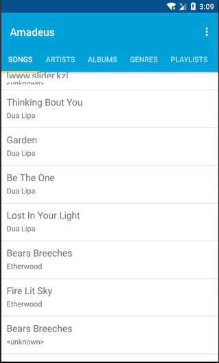

# Amadeus by Jos Vlaar
Amadeus is an app for music lovers and collectors. Many still keep extensive libraries of music with them on their phones.
With a properly tagged and organized library the possibilities for a nice listening experience become endless! Unfortunately most current android music apps only support basic filtering on tags like artist, album or genre.

Amadeaus brings smart playlists to android, allowing users to combine all id-3 tags in their own way to create perfect playlists!

When testing this app make sure that your emulator has mp3 files on it with at least the title, artist, album and genre properly tagged!

# Demo (dutch)
https://vimeo.com/277573182

## Attribution
Special thanks to Sue Smith from Tutplus for [her tutorial](https://code.tutsplus.com/tutorials/create-a-music-player-on-android-project-setup--mobile-22764) on creating a music player in Android.
This tutorial was used as guide to help create the music playback part of Amadeus.