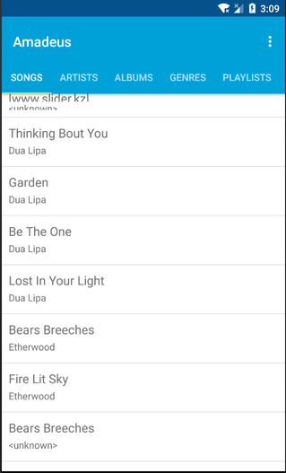

# Technical report
## Amadeus by Jos Vlaar
Amadeus is an app for music lovers and collectors. Many still keep extensive libraries of music with them on their phones.
With a properly tagged and organized library the possibilities for a nice listening experience become endless! Unfortunately most current android music apps only support basic filtering on tags like artist, album or genre.

Amadeaus brings smart playlists to android, allowing users to combine all id-3 tags in their own way to create perfect playlists!

# Overview
Amadeus consist of two main parts: audio playback and playlist handling.
At the core of the app is MainActivity which handles not only interface but also connects the two
parts together.

## The playlist part
_AddPlayListActivity_ This is the activity where new SmartPlaylists are made. The activity allows
a user to select up to two different criteria to filter against.

_DatabaseHelper_ is where most of the playlist handling happens. This helper provides functionality
for reading and writing to a database of songs and playlists and has functions to construct lists of
songs from a SmartPlaylist object.

_SmartPlaylist_ is an object that holds a set of criteria to filter against. This object is used
in DatabaseHelper to construct playlists of songs.

_Song_ is an object that represents a single song and provides methods to access it variables such
as tag information and the file uri. 

## The playback part
_MusicController_ extends MediaController and is a class which creates a set of music
playback controls and shows them on the screen.

_MusicService_ is where the actual playback happens. This is a service so that it can run even when
the app itself is in the background. This class provides functionality for playback such as play, pause as well
as setting songs or the current queue.

# Challenges
During development several challenges were encountered. In this section I will discuss how I faced and
solved those challenges.
## Understanding music playback
Luckily I found a tutorial early on in the project to guide me with creating a music player. However
when I wanted the result to be ever so slightly different I found that I had a lot of trouble with
adjusting the different parts as I had little understanding of what I was doing. This resulted in a lot
of trial and error. While this eventually worked it did cost me a lost of time.

## Getting music playback to run stable
Music playback gave a lot of exceptions that often seemed random. It was hard to fix those exceptions
with limited knowledge. With a lot of Google-fu I was able to solve at least some of them. However there is
still a bug where the MediaController doesn't show up sometimes which I'm hoping you won't encouter during testing.

## Fragment navigation
Fragment navigation turned out to be a lot more difficult than I initially expected. I had to lay
down a lot more plumbing in the form of interfaces and callbacks in an effort to keep everything reusable.
I tried to keep things reusable by making two generic interfaces, _MusicPlayerInterface_ and _PlaylistInterface_,
this allowed me to keep reusable functions in MainActivity without needing to create too many interfaces.

A second part of fragment navigation was handling child fragments and the backstack. This proved to be
a major headache. I wanted to have a fragment with a list of playlists where I could click through to
 one with a list of songs. However these last fragments wouldn't be what was in the tabbar directly.
 I found documentation to be unclear and my app simply did nothing rather than throwing
exceptions so for a while I was stumped.
After a lot of Googling I found the ChildFragmentManager which helped me solve the problems I had.
I could now add the second fragment as a child of the first one allowing me to get the behaviour I wanted.